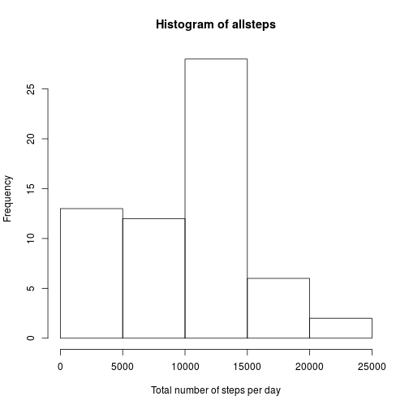
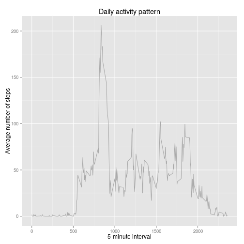
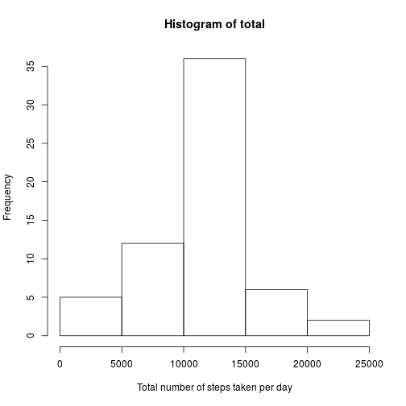
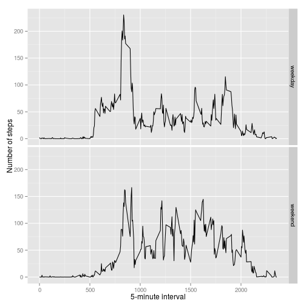

## Loading and preprocessing the data


```r
unzip("activity.zip")
rawdata <- read.csv("activity.csv")
```

## What is mean total number of steps taken per day?


```r
library(ggplot2)
allsteps <- tapply(rawdata$steps, rawdata$date, FUN=sum, na.rm = TRUE)
hist(allsteps, xlab = "Total number of steps per day")
```

 

```r
mean(allsteps, na.rm = TRUE)
```

```
## [1] 9354.23
```

```r
median(allsteps, na.rm = TRUE)
```

```
## [1] 10395
```

## What is the average daily activity pattern?


```r
ave <- aggregate(x=list(steps=rawdata$steps), by=list(interval=rawdata$interval),
            FUN=mean, na.rm=TRUE)
ggplot(data=ave, aes(x=interval, y=steps)) +
    geom_line(color = "darkgrey") +
    labs(x = "5-minute interval") +
    labs(y = "Average number of steps") +
    labs(title = "Daily activity pattern")
```

 

Which 5-minute interval, on average across all the days in the dataset, 
contains the maximum number of steps?


```r
ave[which.max(ave$steps) ,]
```

```
##     interval    steps
## 104      835 206.1698
```


## Imputing missing values

Note that there are a number of days/intervals where there are missing values 
(coded as NA). The presence of missing days may introduce bias into some 
calculations or summaries of the data.


```r
miss <- is.na(rawdata$steps)
```
Show the total number of rows with NA's

```r
table(miss)
```

```
## miss
## FALSE  TRUE 
## 15264  2304
```

A strategy for filling in all of the missing values in the dataset. 
The mean is used as a good strategy.


```r
fill <- function(steps, interval) {
    filled <- NA
    if (!is.na(steps))
        filled <- c(steps)
    else
        filled <- (ave[ave$interval==interval, "steps"])
    return(filled)
}
```

Create a new dataset that is equal to the original dataset but with the missing 
data filled in.


```r
filled <- rawdata
filled$steps <- mapply(fill, filled$steps, filled$interval)
```

Make a histogram of the total number of steps taken each day and Calculate and 
report the mean and median total number of steps taken per day.


```r
total <- tapply(filled$steps, filled$date, FUN=sum)
hist(total,  xlab="Total number of steps taken per day")
```

 

```r
mean(total)
```

```
## [1] 10766.19
```

```r
median(total)
```

```
## [1] 10766.19
```

Do these values differ from the estimates from the first part of the assignment?

Yes.

What is the impact of imputing missing data on the estimates of the total daily 
number of steps?

The median is resistant to extreme values.

## Are there differences in activity patterns between weekdays and weekends?

Create a new factor variable in the dataset with two levels – “weekday” and “weekend” indicating whether a given date is a weekday or weekend day.


```r
dayorand  <- function(date) {
    day <- weekdays(date)
    if (day %in% c("Monday", "Tuesday", "Wednesday", "Thursday", "Friday"))
        return("weekday")
    else if (day %in% c("Saturday", "Sunday"))
        return("weekend")
    else
        stop("invalid date")
}
```

Create a new factor variable


```r
filled$date <- as.Date(filled$date)
filled$day <- sapply(filled$date, FUN = dayorand)
```

Make a panel plot containing a time series plot


```r
averages <- aggregate(steps ~ interval + day, data=filled, mean)
ggplot(averages, aes(interval, steps)) + 
      geom_line() +
facet_grid(day ~ .) +
    xlab("5-minute interval") + ylab("Number of steps")
```

 
